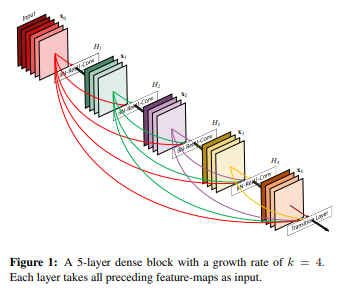
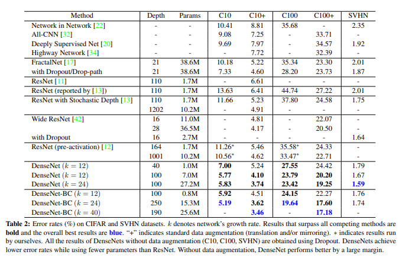

# [Densely Connected Convolutional Networks (DenseNet)](https://arxiv.org/abs/1608.06993)
## Dependency : 
<ol>
    <li>pytorch 1.4.0</li>
    <li>torchvision 0.5.0</li>
    <li>numpy</li>
    <li>tqdm</li>
    <li>[InPalce ABN](https://github.com/mapillary/inplace_abn)</li>
</ol>

## Introduction

The repositroy training a DenseNet model on Cifar10 Dataset, and could be rewrite easily for ImageNet.

The main goal is training a DenseNet-BC on Cifar10 in single Nivida GPU GTX-1080ti for memory capacity 11 GiB, and the [Inplace ABN](https://arxiv.org/abs/1712.02616) and [Memory-efficient implementation of densenets](https://arxiv.org/abs/1707.06990) are helpful for memory efficient.
    
<code>usage main.py [--batch_size N][--learning_rate Float][--weight_decay Float][--momentum Float]
               [--cuda N][--log PATH][--preceed Boolean][--training_epoch N]
 
optional arguments:
    --batch_size               default=64,                traing and testing batch size
    --learning_rate            default=1e-1,              optimizer learning rate
    --weight_decay             default=1e-4,              optimizer L2 penalty
    --momentum                 default=0.9,               optimizer momentum
    --cuda                     default='0',               GPU Index for training
    --log                      default='../result/log',   tensorboard log directory
    --preceed                  default=False,             whether load a pretrain model
    --training_epoch           default=300,               total training epoch
</code>

## DenseNet

    To avoid information be transferred through layers by layers, the convolutional layer output is concatenated to all previous layer outputs in the DenseBlock as the inputs to next layer. The generated features channels could be compressed into a very low size. And the connection from each Layer helps to deal with gradient vanishing which is a frequent problem for very Deep Model. 

    Affected by ResNet, DenseNet structure could be constructed by DenseBlock, which is divided by pool layers. There are special construction for decreasing FLOPs, Bottlenect layers, and compression rate, both of them have been proved by experiment is beneficial for performance.

## Implement Results
<table>
  <tr>
      <td><h2>Loss</h2></td>
      <td><h2>Error rate</h2></td>
  </tr>
  <tr>
      <td></td>
      <td></td>
    </tr>
</table>