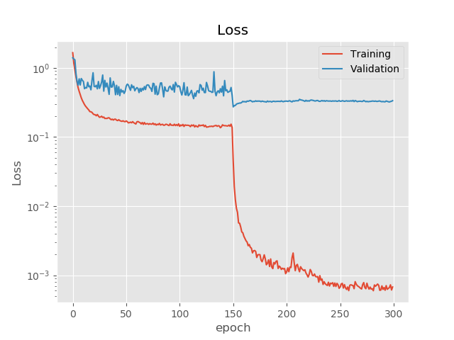

# [Densely Connected Convolutional Networks (DenseNet)](https://arxiv.org/abs/1608.06993)
Dependency : 
<ol>
    <li>pytorch 1.4.0</li>
    <li>numpy</li>
    <li>tqdm</li>
    <li>[InPalce ABN](https://github.com/mapillary/inplace_abn)</li>
</ol>

The repositroy training a DenseNet model on Cifar10 Dataset, and could be rewrite easily for ImageNet.

The main goal is training a DenseNet-BC in single Nivida GPU GTX-1080ti for memory 11.GiB, and the [Inplace ABN](https://arxiv.org/abs/1712.02616) and [Memory-efficient implementation of densenets.](https://arxiv.org/abs/1707.06990) are helpful.

<table>
  <tr>
      <td><h2>Loss</h2></td>
      <td><h2>Error rate</h2></td>
  </tr>
  <tr>
      <td></td>
      <td></td>
    </tr>
</table>