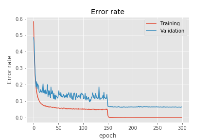

# [Densely Connected Convolutional Networks (DenseNet)](https://arxiv.org/abs/1608.06993)

<table>
  <tr>
    <td><h2>Loss</h2></td>
    <td><h2>Error rate</h2></td>
  </tr>
  <tr>
      <td></td>
      <td></td>
    </tr>
</table>